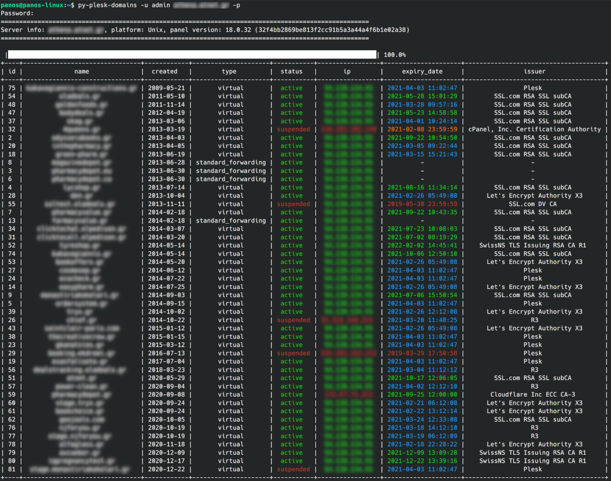

# py-plesk-domains
A python script to get some basic data about domains from a server with plesk panel.
Except from the data that plesk's api returns (id, domain, created datetime, type, status), the script also returns the domain's current ip, certificate expiration and issuer.


## Installation
It's recommended to use Python 3.7 or newer.   

```pip install git+https://github.com/takisrs/py-plesk-domains.git```   


## Docker
Alternatively, you may quick run it through docker...   

1. By cloning this repo and using the provided docker-dompose.yml file:   
ex.   
```docker-compose run --rm py-plesk-domains server-hostname.com -u admin -o ./ -p```  

2. Or by pulling and running the image that has been uploaded in the docker hub:   
ex.   
```docker container run -it --rm -v ${PWD}:/app takisrs/py-plesk-domains server-hostname.com -u admin -o ./ -p```   
   

## Instructions
```
panos@panos-linux:~$ py-plesk-domains -h
usage: py-plesk-domains [-h] -u USERNAME -p [PASSWORD] [-s {name,created,type,status,ip,expiry_date,issuer}] [-f {plain,simple,github,grid,fancy_grid,pipe,orgtbl,jira,presto,pretty,psql,rst,mediawiki,moinmoin,youtrack,html,latex,latex_raw,latex_booktabs,textile}]
                        [-o CSVPATH]
                        host

Returns the domains from a server with plesk panel with some extra info for each domain (current domain's ip address, certificate expiration date, certificate issuer).

positional arguments:
  host                  server hostname or ip address

optional arguments:
  -h, --help            show this help message and exit
  -u USERNAME           Plesk administrator username
  -p [PASSWORD]         Plesk administrator password
  -s {name,created,type,status,ip,expiry_date,issuer}
                        Select a sorting option. Default: created
  -f {plain,simple,github,grid,fancy_grid,pipe,orgtbl,jira,presto,pretty,psql,rst,mediawiki,moinmoin,youtrack,html,latex,latex_raw,latex_booktabs,textile}
                        Select a formatting option for the table. Default: pretty
  -o CSVPATH            Optionally, Provide a path to export the data in a csv file
```

**Example command:**  
```py-plesk-domains server-hostname.com -u admin -s expiry_date -f rst -o ~/domains/ -p```   


## Demo
